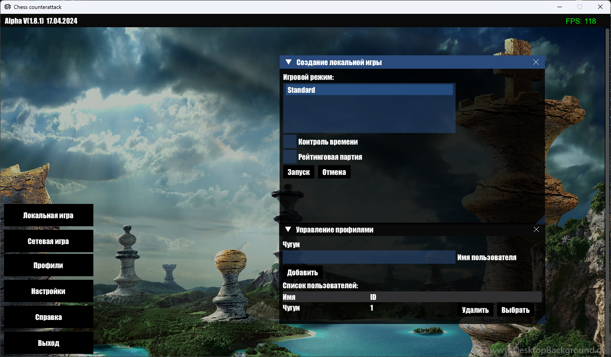
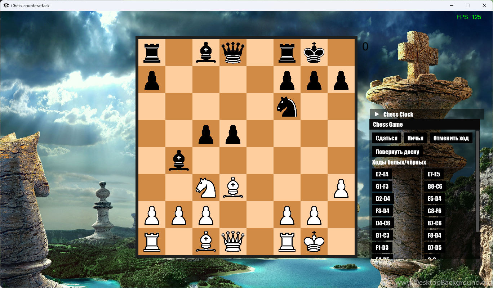

# Chess in C++  

This project is a chess game with network code, implemented in C++ using the SFML framework.

<p align="center">
  
  
</p>

## Dependencies

The project uses the following libraries and tools:

- [SFML](https://www.sfml-dev.org/): A simple multimedia library for C++
- [ImGui](https://github.com/ocornut/imgui): Library for creating graphical interfaces
- [ImGui-SFML](https://github.com/eliasdaler/imgui-sfml): Integration of ImGui with SFML
- [SQLite3](https://www.sqlite.org/index.html): Embedded SQL database
- [nlohmann-json](https://github.com/nlohmann/json): Library for working with JSON in C++

## Installation

Prerequisites

Before you begin installation, make sure you have the following components installed:

- CMake
- vcpkg
- SFML
- ImGui
- ImGui-SFML
- SQLite3
- nlohmann-json

### Installation Instructions

1. Clone the repository:

```bash
git clone https://github.com/Agenteec/ChessSFML.git
```
2. Go to the project directory:
```bash
cd ChessSFML
```
3. Create a text file 'vcpkg.cmake' with the following content:
```cmake
if(CMAKE_SYSTEM_NAME MATCHES "Linux")
    include("path/to/vcpkg/scripts/buildsystems/vcpkg.cmake")
elseif(CMAKE_SYSTEM_NAME MATCHES "Windows")
    include("path/to/vcpkg/scripts/buildsystems/vcpkg.cmake")
endif()
```
4. Create a build directory and go to it:
```bath
mkdir build
cd build
```
5. Generate the build files using CMake:
```bath
cmake ..
```
